# StateDB_Light API接口文档

## 测试过的接口
### CreateAccount
- Method：post
- Path：`/api/sdb/createaccount`
- Param Type : Json
- Param Content:
```
CreateAccountRequest {
    Addr string `json:"address"`
}
```
输入地址
- Return Value:
```
CreateAccountResponse {
    Empty bool `json:"empty"`
}
```
Empty为占位符，无实际意义

- Example:

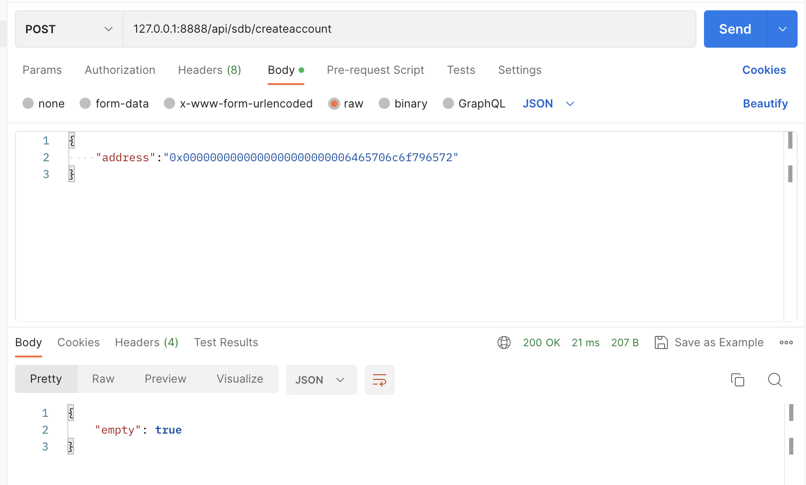

### AddBalance
- Method：post
- Path：`/api/sdb/addbalance`
- Param Type : Json
- Param Content:
```
AddBalanceRequest {
    Addr   string `json:"address"`
    Amount int64  `json:"amount"`
}
```
- Return Value:
```
AddBalanceResponse {
    Empty bool `json:"empty"`
}
```
- Example
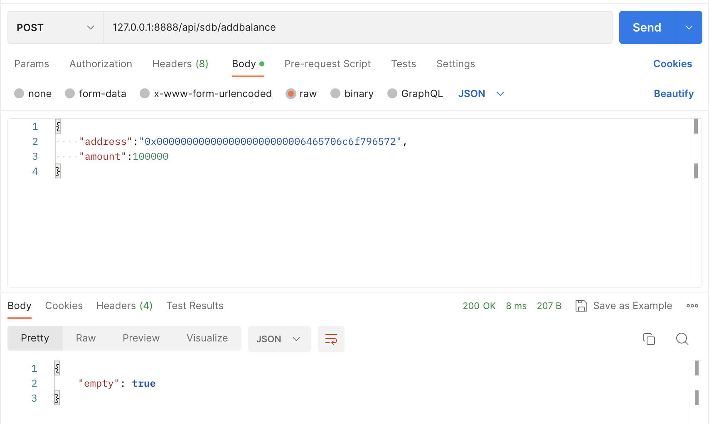

### Subbalance
- Method：post
- Path：`/api/sdb/subbalance`
- Param Type : Json
- Param Content:
```
SubBalanceRequest {
    Addr   string `json:"address"`
    Amount int64  `json:"amount"`
}
```
- Return Value:
```
SubBalanceResponse {
    Empty bool `json:"empty"`
}
```
- Example
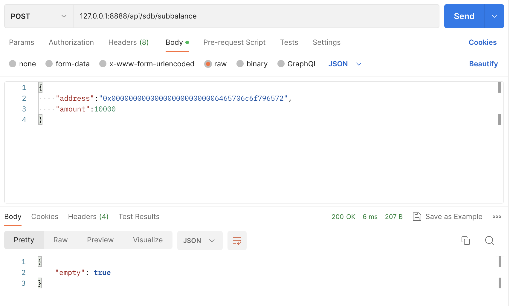

### GetBalance
- Method：post
- Path：`/api/sdb/getbalance`
- Param Type : Json
- Param Content:
```
GetBalanceRequest {
    Addr string `json:"address"`
}
```
- Return Value:
```
GetBalanceResponse {
    Amount int64 `json:"amount"`
}
```
- Example
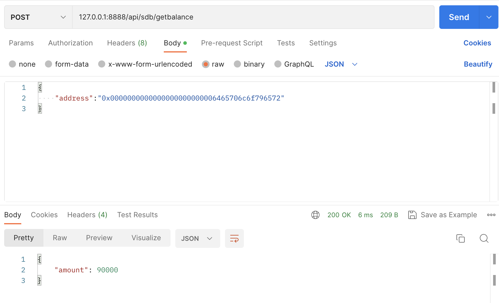

### Suicide
- Method：post
- Path：`/api/sdb/suicide`
- Param Type : Json
- Param Content:
```
SuicideRequest {
    Addr string `json:"address"`
}
```
- Return Value:
```
SuicideResponse {
    Is_suicide bool `json:"is_suicide"`
}
```
- Example


### HasSuicided
- Method：post
- Path：`/api/sdb/hassuicided`
- Param Type : Json
- Param Content:
```
HasSuicidedRequest {
    Addr string `json:"address"`
}
```
- Return Value:
```
HasSuicidedResponse {
    Is_suicide bool `json:"is_suicide"`
}
```
- Example
PS: 此处选择了一个不存在的地址，因此返回了false
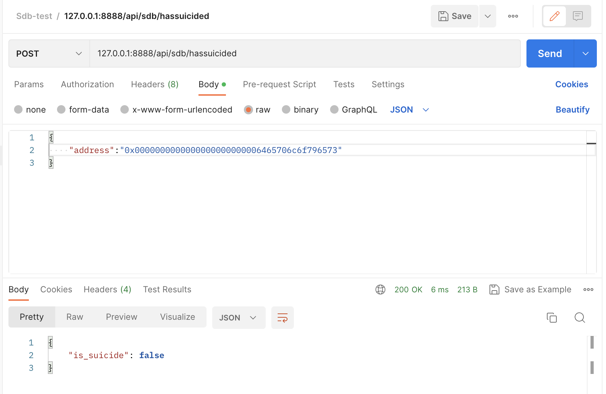

### SetNonce
- Method：post
- Path：`/api/sdb/setnonce`
- Param Type : Json
- Param Content:
```
SetNonceRequest {
    Addr   string `json:"address"`
    Amount uint64 `json:"amount"`
}
```
- Return Value:
```
SetNonceResponse {
    Empty bool `json:"empty"`
}
```
- Example
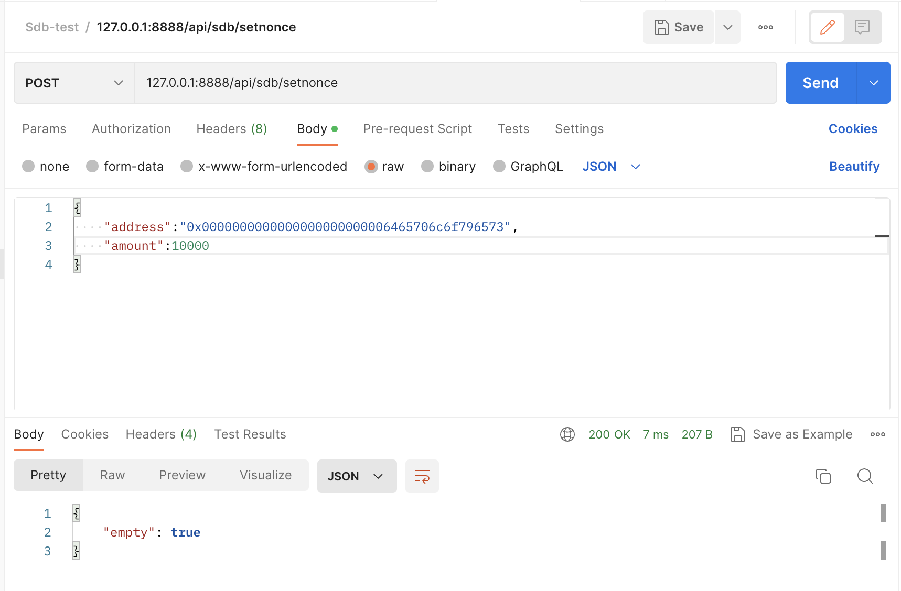

### Getnonce
- Method：post
- Path：`/api/sdb/getnonce`
- Param Type : Json
- Param Content:
```
GetNonceRequest {
    Addr string `json:"address"`
}
```
- Return Value:
```
GetNonceResponse {
    Amount uint64 `json:"amount"`
}
```
- Example


### SetCode
- Method：post
- Path：`/api/sdb/setcode`
- Param Type : Json
- Param Content:
```
SetCodeRequest {
    Addr string `json:"address"`
    Code string `json:"code"`
}
```
- Return Value:
```
SetCodeResponse {
}
```
- Example
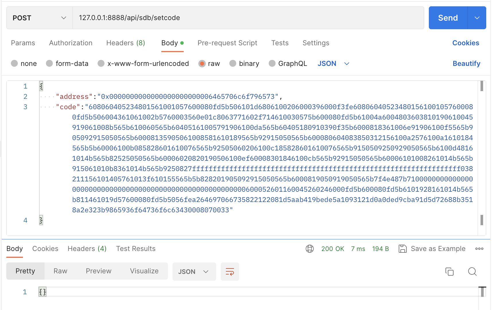

### GetCode
- Method：post
- Path：`/api/sdb/getcode`
- Param Type : Json
- Param Content:
```
GetCodeRequest {
    Addr string `json:"address"`
}
```
- Return Value:
```
GetCodeResponse {
    Code string `json:"code"`
}
```
- Example
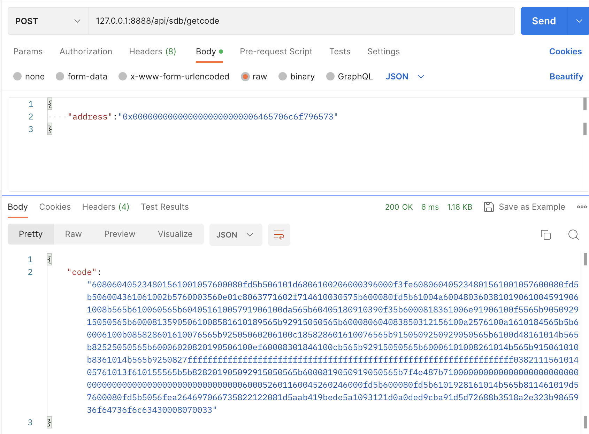

### Getcodesize
- Method：post
- Path：`/api/sdb/getcodesize`
- Param Type : Json
- Param Content:
```
GetCodeSizeRequest {
    Addr string `json:"address"`
}
```
- Return Value:
```
GetCodeSizeResponse {
    Size int32 `json:"size"`
}
```
- Example
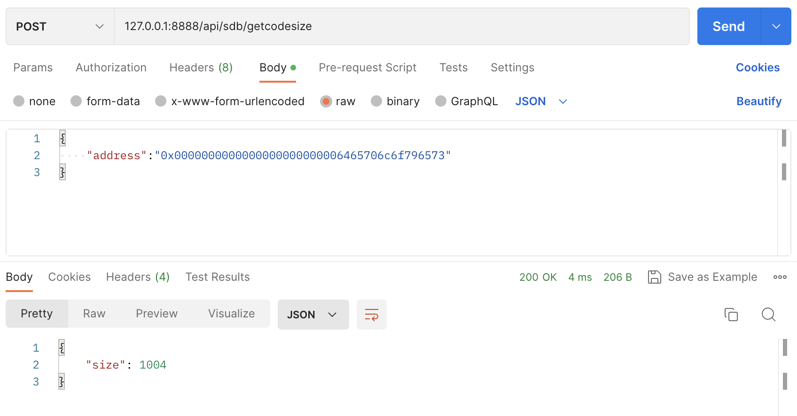

### GetCodeHash
- Method：post
- Path：`/api/sdb/getcodehash`
- Param Type : Json
- Param Content:
```
GetCodeHashRequest {
    Addr string `json:"address"`
}
```
- Return Value:
```
GetCodeHashResponse {
    Hash string `json:"hash"`
}
```
- Example
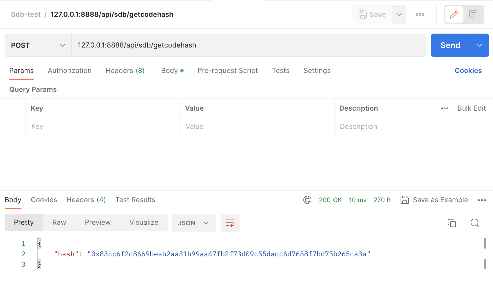

### AddRefund
- Method：post
- Path：`/api/sdb/addrefund`
- Param Type : Json
- Param Content:
```
AddRefundRequest {
    Amount uint64 `json:"amount"`
}
```
- Return Value:
```
AddRefundResponse {
}
```
- Example
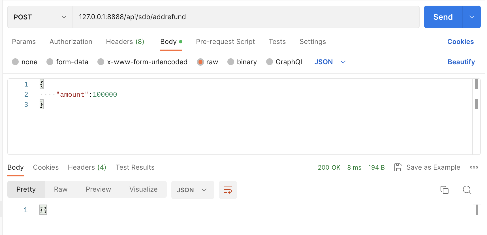

### SubRefund
- Method：post
- Path：`/api/sdb/subrefund`
- Param Type : Json
- Param Content:
```
SubRefundRequest {
    Amount uint64 `json:"amount"`
}
```
- Return Value:
```
SubRefundResponse {
}
```
- Example
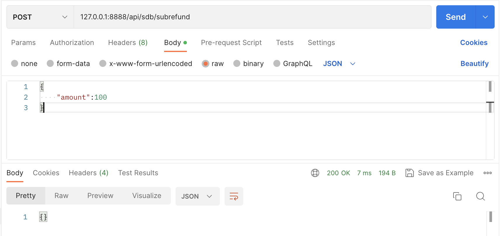

### GetRefund
- Method：post
- Path：`/api/sdb/getrefund`
- Param Type : Json
- Param Content:
```
GetRefundRequest {
}
```
- Return Value:
```
GetRefundResponse {
    Amount uint64 `json:"amount"`
}
```
- Example
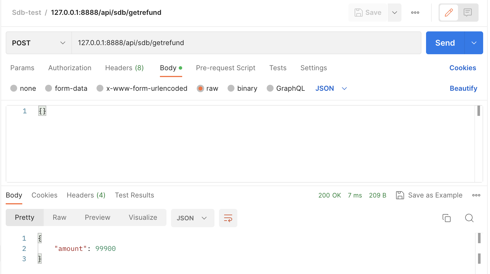

### Empty
- Method：post
- Path：`/api/sdb/empty`
- Param Type : Json
- Param Content:
```
EmptyRequest {
    Addr string `json:"address"`
}
```
- Return Value:
```
EmptyResponse {
    Is_empty bool `json:"is_empty"`
}
```
- Example
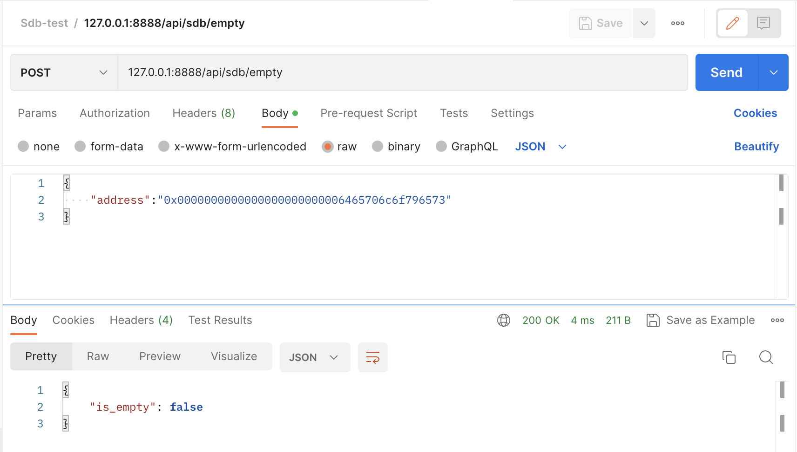

### Exist
- Method：post
- Path：`/api/sdb/exist`
- Param Type : Json
- Param Content:
```
ExistRequest {
    Addr string `json:"address"`
}
```
- Return Value:
```
ExistResponse {
    Is_exist bool `json:"is_exist"`
}
```
- Example
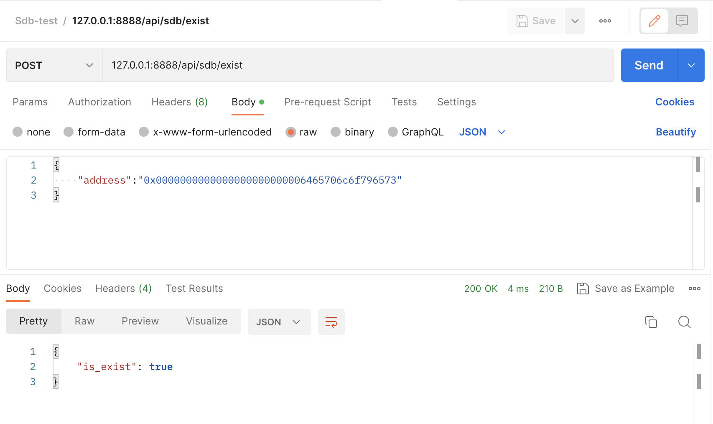

### AddAddressToAccessList
- Method：post
- Path：`/api/sdb/addaddresstoaccesslist`
- Param Type : Json
- Param Content:
```
AddAddressToAccessListRequest {
    Addr string `json:"address"`
}
```
- Return Value:
```
AddAddressToAccessListResponse {
}
```
- Example
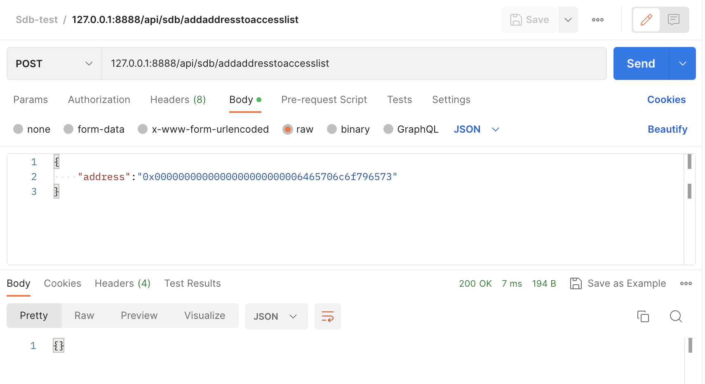

### AddressInAccessList
- Method：post
- Path：`/api/sdb/addressinaccesslist`
- Param Type : Json
- Param Content:
```
AddressInAccessListRequest {
    Addr string `json:"address"`
}
```
- Return Value:
```
AddressInAccessListResponse {
    Is_in bool `json:"is_in"`
}
```
- Example
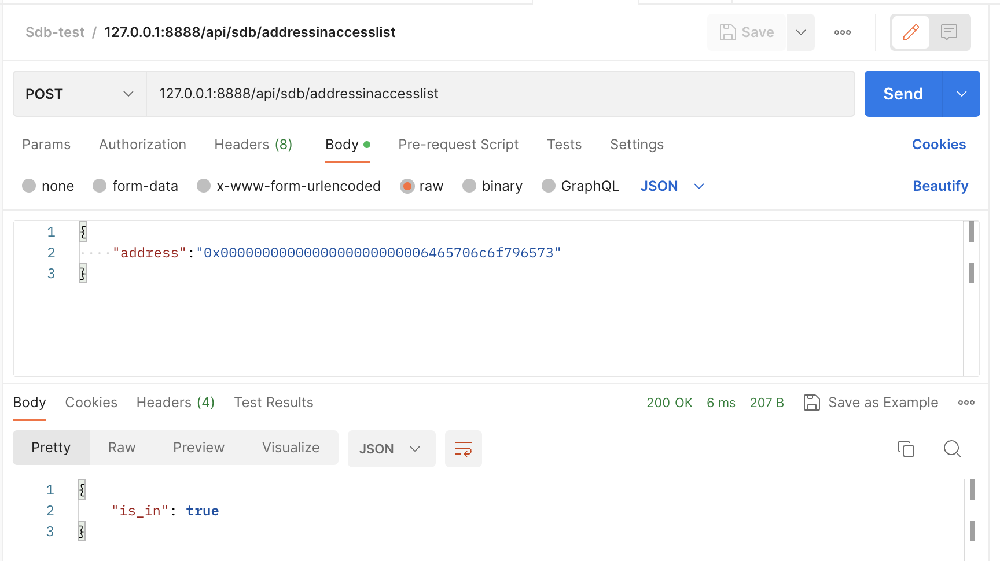


## 无法测试的接口
### RevertToSnapshot
- Method：post
- Path：`/api/sdb/reverttosnapshot`
- Param Type : Json
- Param Content:
```
RevertToSnapshotRequest {
    Revid int32 `json:"revid"`
}
```
- Return Value:
```
RevertToSnapshotResponse {
}
```

### Snapshot
- Method：post
- Path：`/api/sdb/snapshot`
- Param Type : Json
- Param Content:
```
SnapshotRequest {
}
```
- Return Value:
```
SnapshotResponse {
    Revid int32 `json:"revid"`
}
```

### AddSlotToAccessList
- Method：post
- Path：`/api/sdb/addslottoaccesslist`
- Param Type : Json
- Param Content:
```
AddSlotToAccessListRequest {
    Addr string `json:"address"`
    Slot string `json:"slot"`
}
```
- Return Value:
```
AddSlotToAccessListResponse {
}
```

### SlotInAccessList
- Method：post
- Path：`/api/sdb/slotinaccesslist`
- Param Type : Json
- Param Content:
```
SlotInAccessListRequest {
    Addr string `json:"address"`
    Hash string `json:"hash"`
}
```
- Return Value:
```
SlotInAccessListResponse {
    Addr_ok bool `json:"addr_ok"`
    Slot_ok bool `json:"slot_ok"`
}
```

### AddPreimage
- Method：post
- Path：`/api/sdb/addpreimage`
- Param Type : Json
- Param Content:
```
AddPreimageRequest {
    Hash     string `json:"hash"`
    Preimage string `json:"preimage"`
}
```
- Return Value:
```
AddPreimageResponse {
}
```

### AddLog
- Method：post
- Path：`/api/sdb/addlog`
- Param Type : Json
- Param Content:
```
AddLogRequest {
    // Consensus fields:
    // address of the contract that generated the event
    Address string `json:"address"`
    // list of topics provided by the contract.
    Topics []string `json:"topics"`
    // supplied by the contract, usually ABI-encoded
    Data string `json:"data"`

    // Derived fields. These fields are filled in by the node
    // but not secured by consensus.
    // block in which the transaction was included
    BlockNumber uint64 `json:"blockNumber"`
    // hash of the transaction
    TxHash string `json:"transactionHash"`
    // index of the transaction in the block
    TxIndex uint `json:"transactionIndex"`
    // hash of the block in which the transaction was included
    BlockHash string `json:"blockHash"`
    // index of the log in the block
    Index uint32 `json:"logIndex"`

    // The Removed field is true if this log was reverted due to a chain reorganisation.
    // You must pay attention to this field if you receive logs through a filter query.
    Removed bool `json:"removed"`
}
```
- Return Value:
```
AddLogResponse {
}
```

### Prepare
- Method：post
- Path：`/api/sdb/prepare`
- Param Type : Json
- Param Content:
```
Rules {
    ChainID          string `json:"chainid"`
    IsHomestead      bool   `json:"ishomestead"`
    IsEIP150         bool   `json:"iseip150"`
    IsEIP155         bool   `json:"iseip155"`
    IsEIP158         bool   `json:"iseip158"`
    IsByzantium      bool   `json:"isbyzantium"`
    IsConstantinople bool   `json:"isconstantinople"`
    IsPetersburg     bool   `json:"ispetersburg"`
    IsIstanbul       bool   `json:"isistanbul"`
    IsBerlin         bool   `json:"isberlin"`
    IsLondon         bool   `json:"islondon"`
    IsMerge          bool   `json:"ismerge"`
    IsShanghai       bool   `json:"isshanghai"`
    IsCancun         bool   `json:"iscancun"`
    IsPrague         bool   `json:"isprague"`
}

AccessTuple {
    Addr        string   `json:"address"`
    StorageKeys []string `json:"storagekeys"`
}

PrepareRequest {
    Rule         Rules         `json:"rules"`
    SenderAddr   string        `json:"senderaddr"`
    CoinbaseAddr string        `json:"coinbaseaddr"`
    DestAddr     string        `json:"destaddr"`
    PreCompiles  []string      `json:"precompiles"`
    List         []AccessTuple `json:"list"`
}
```
- Return Value:
```
PrepareResponse {
}
```

## template
- Method：post
- Path：`/api/sdb/`
- Param Type : Json
- Param Content:
```
```
- Return Value:
```
```
- Example
