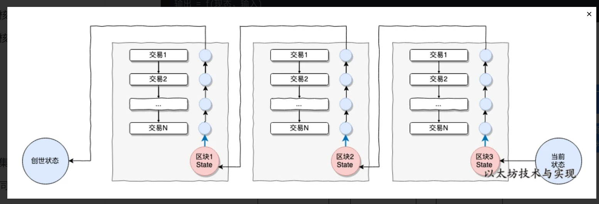
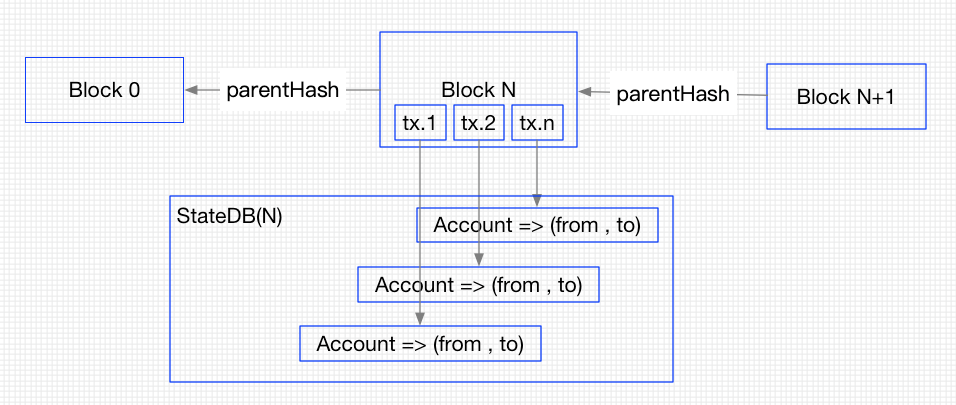
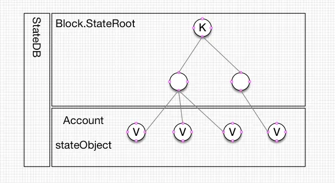
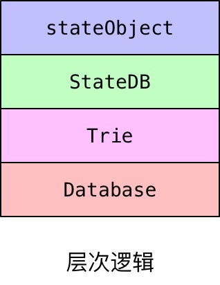

# 3月19笔记

## 基本背景

首先需要知道，以太坊是一种State区块链，区别于UTXO型，其每次完成交易后，都是通过记录每一个账户的状态从而记录整个区块链上的变化，而非像比特币记录交易。

因此，整个以太坊区块连在任意时刻，只会处于一个状态中，同时也是全世界唯一的状态。我们把这个状态机，称之为以太坊世界状态，代表着以太坊网络的全局状态。

世界状态(state)由无数的账户信息组成，每个账户均存在一个唯一的账户信息。账户信息中存储着账户余额、Nonce、合约哈希、账户状态等内容，每个账户信息通过账户地址影射。 从创世状态开始，随着将交易作为输入信息，在预设协议标准（条件）下将世界态推进到下一个新的状态中。

## StateDB是什么

以太坊是基于账户体系实现的，块通过 parentHash 链在一起，每个块都包含若干交易，每个交易都包含账户 from 和 to(部署合约时除外),全部的账户凑在一起就是组成了 StateDB，每个块的 StateDB 都用一颗叫做 Trie 的树来组织账户信息，具体结构如下图：

StateDB通常会存储在磁盘上，通过 Block.StateRoot 来进行加载，StateRoot 是树根，也是 leveldb 中的一个 key, 这个根只对应当前块的交易相关的账户信息，value 是这棵树的全部叶子节点，加载的时候会用叶子节点来构建下图中的树型结构。

## 存储结构

在`core/state/database.go`文件中，定义了两重DB，即`cachingDB`以及`DataBase`，而`DataBase`利用底层LevelDB，运行`state.NewDatabase(rawdb.NewMemoryDatabase())`进行初始化，其中输入的参数即为LevelDB。

其中StateDB (DataBase) 使用Trie存放stateObject，是账户地址到账户信息的映射，每个stateObject都是一个账户的信息。

stateObject使用Trie存放数据，这些数据被称为storage，实现对某个账户的状态数据的存储和修改，key是数据的hash值，value是状态数据。

StateDB和stateObject都使用Database存放了自己的Trie，他们使用的是同一个DB。

因此逻辑上看他们有如下关系:

## 基本需要实现的功能（接口）

stateDB对象就是对以太坊状态MPT进行管理的对象。其管理功能包括：
1. 初始化：New
2. 增加：StateDB.createObject
3. 删除：StateDB.Suicide
4. 修改：StateDB.AddBalance
5. 查询：StateDB.GetBalance
6. 拍摄快照：StateDB.Snopshot
7. 恢复快照：StateDB.RevertToSnopshot
8. 将状态写入状态树：StateDB.Finalise
9. 获得树根：StateDB.IntermediateRoot
10. 将状态写入数据库：StateDB.Commit

## Ref
- https://learnblockchain.cn/books/geth/part3/statedb.html
- https://www.jianshu.com/p/db49103c8ee8
- https://www.bcskill.com/index.php/archives/1160.html
- https://blog.csdn.net/lj900911/article/details/85047957
